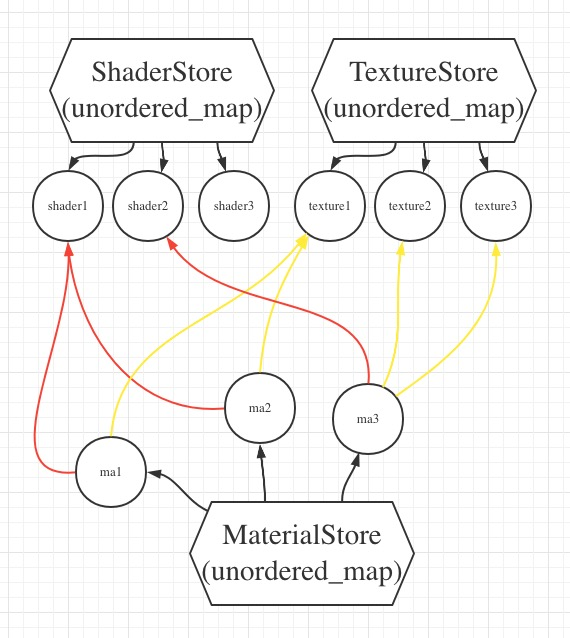
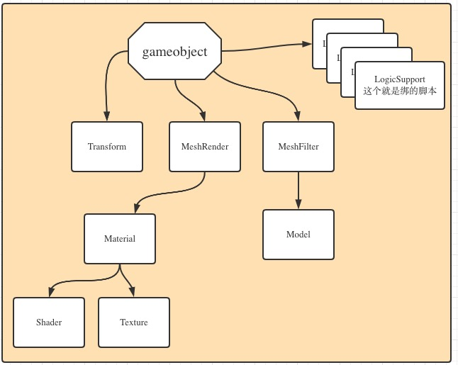

# Material 概念

在渲染过程中一个Material主要有两方面的任务：

- 1. 代表一个物体的表面性质，例如diffuse颜色，光滑度等
- 2. 代表这个物体要用什么 shader 进行绘制

以上两个方面导致了这个Material是一个极其抽象的东西，所以本引擎直接写成 Abstract class。
```cpp
namespace mc::low
{
    class Engine;
    class GameObject;

    class Material
    {
    public:
        virtual void PostUniform(Engine *eg, GameObject *gb) = 0;
        virtual void SetShader(ShaderP shader) = 0;
        virtual void AddTexture(TextureP texture) = 0;
        virtual ~Material() = default;
    };
}
```

# 新建 Material 需要实现三个方法

### 一. `PostUniform` 

- 原型: `virtual void PostUniform(Engine *eg, GameObject *gb)`

- 作用: `Engine` 在绘制的时候，会直接调用这个函数来做 uniform 的传递

- 这个方法完全由用户自己填写，用户应该知道拥有什么 uniform

- 两个`参数`是为了用户能够获取一些全局的参数,以及本 `gameobject` 的参数

### 二. `SetShader`

- 原型: `virtual void SetShader(ShaderP shader)`

- 作用: 设置真正绘制的 `shader`

- 用户自己负责找到需要的 `shader`, 通过 `ShaderStore.Get(int key)`, 这个后面要讲到。

### 三. `AddTexture`

- 原型 `virtual void AddTexture(TextureP texture)`

- 作用 添加texture引用，因为shader里可能需要texture

- 为什么这里是`Add`而不是`Set`，是因为一个shader里，经常需要使用多个 `texture`

- 用户自己负责如何存储多个 texture , 以及传递 uniform

# 类关系图

`Material Shader Texture` 三种资源，从文件中加载之后，
应该马上 `Register` 到相应的 `Store` 中，如下所示。
程序中如果需要动态获得某种资源，应该用`key`到相应的`Store`中查询获得。
当前的`key`都是 `int` 类型, 不用 `string` 是因为后期这种绑定关系都是场景加载的一部分。
暂时就凑合用。



上图可以看出，任意两个`Material`

- 1. 可以引用相同的 `shader` 和 `texture`。

- 2. 也可以引用不同的 `shader` 和 `texture`。


# 实际新建一个`Material`详细步骤

- 1. 在 `others/include/game/`目录下新建一个 header 文件，代表你的`Material`, 例如
`phong_spot.h`

- 2. 将前面讲的三个虚函数实现。参照 `phong_spot.cpp`，注意，将相应cpp代码放到 `src/game/`下。

- 3. 给自己的class新建一个静态方法，用于读取文件
参照 `phong_spot.cpp` 中的写法

- 4. 在实际使用的时候，也就是`main.cpp`中，需要先试用上述静态方法，读取资源，然后最重要的一步就是注册到 `Store`：

```cpp
{
    // 从文件 加载 phong 材质， spot light
    auto list = game::MaterialPhongSpot::LoadSurfaceDataFromFile("../others/resource/material/all.material");
    // 注册到 engine 中
    for (auto one : list)
    {
        one->SetShader(gogogo.GetShaderStore().Get(2)); // 设置一下关联的shader 2
        one->AddTexture(gogogo.GetTextureStore().Get(1));
        materialstore.Register(one);
    }
}
```
注意，妥善调用`SetShader`和`AddTexture`。

- 5. gameobject 如何使用上述`Material`呢，参照 `main.cpp`中的`GetOneRender函数`。参照下图:

